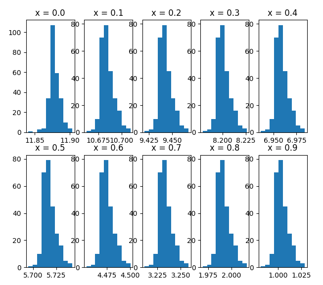
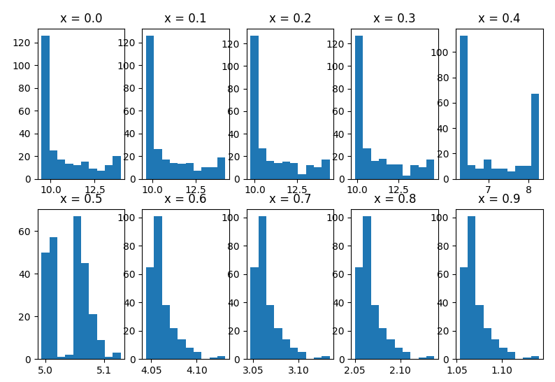

# Playing around with GANs
## trying to make them model arrival distributions conditioned on facts

### Situation to model:
Two chipmunks are going to a chestnut party at B (x = 1). They live together at A (x = 0). Chipmunk 1 run all the way to B at constant speed. Chipmunk 2 run just as fast and steadily, but has to tie their shoelaces halfway (at x = 0.5). Their respective trajectories are measured and at each measurement, the time left to arrive at the party is calculated (y). Here is how chipmunk 1 and 2 ran:

| x | y1 | y2 |
|---|----|----|
| 0 | 10 | 13 |
|0.1| 9  | 12 |
|0.2| 8  | 11 |
|0.3| 7  | 10 |
|0.4| 6  | 9  |
|0.5| 5  | 8  |
|0.6| 4  | 4  |
|0.7| 3  | 3  |
|0.8| 2  | 2  |
|0.9| 1  | 1  |
| 1 | 0  | 0  |

### Try 1 (GAN_test1.py)
Using the standard loss (minimizing cross entropy) for the discriminator and a min/max loss (minimizing the Kullback-Leibler divergence) for the generator

### Try 2 (GAN_test2.py)
LSGAN minimizing the Pearson divergence:

